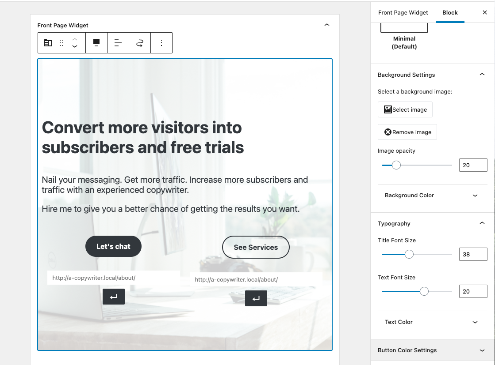
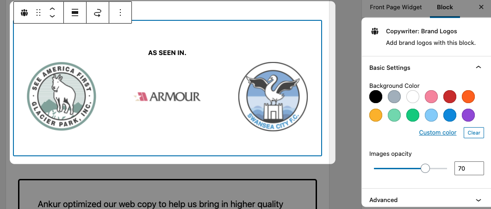
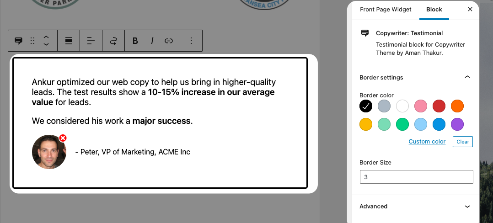
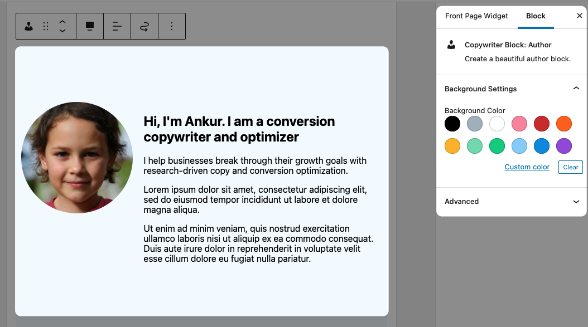
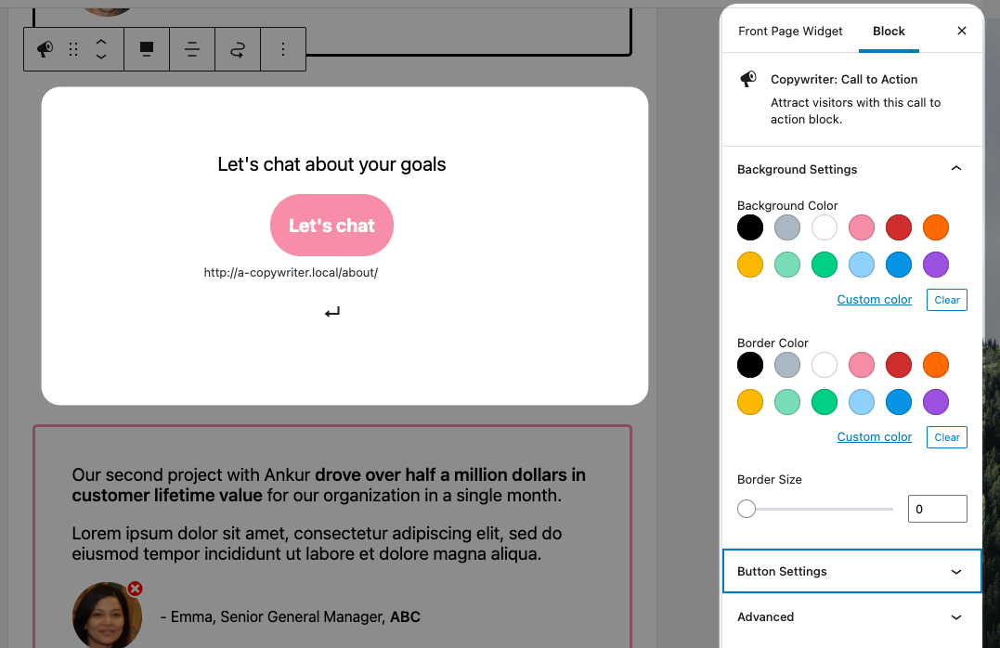

# Copywriter Blocks Plugin

To install:

- Download the zip arhive of plugin from [releases tab](https://github.com/madebyaman/copywriter-blocks/releases)
- In WP Admin Options, click "Plugins", followed by "Add New"
- Click "Upload Plugin" and upload the plugin.

## Usage Instructions

Every block comes with many customization options like:

- Changing Background Color
- Changing width for the block
- Changing content alignment

You can use these options to customize the look of a block.

To get started on using a block, simply type `/` in the editing area, followed by `Copywriter:`. Then you can pick the block you want to add.

## Hero Block

Hero block allows you to:

- change the style
- add a background image
- change background image opacity
- add a background color
- change font sizes
- change colors for text, and buttons

Besides, you also control over displaying certain items. For example, if you don't want to have the secondary button, don't fill the text and url for secondary button and it will not show on the frontend.

### Brand Logos Block

This block allows you to add up to 3 brand logos. You also can change the background color and image opacity.

### Testimonial Block

With the testimonial block you can add text, image, and author credentials. The block allows you to change its border color and border size.

### Author Bio

The author bio block allows you to add beautiful author box. You can control its background color and text color.

### Call To Action Block

The call to action block is highly customizable block. You have the option to control its:

- background color
- border color
- border size
- button size
- button shape
- button text color and background color

By playing with these options, you can create different call to action for your site.

Now, go ahead and install the plugin
